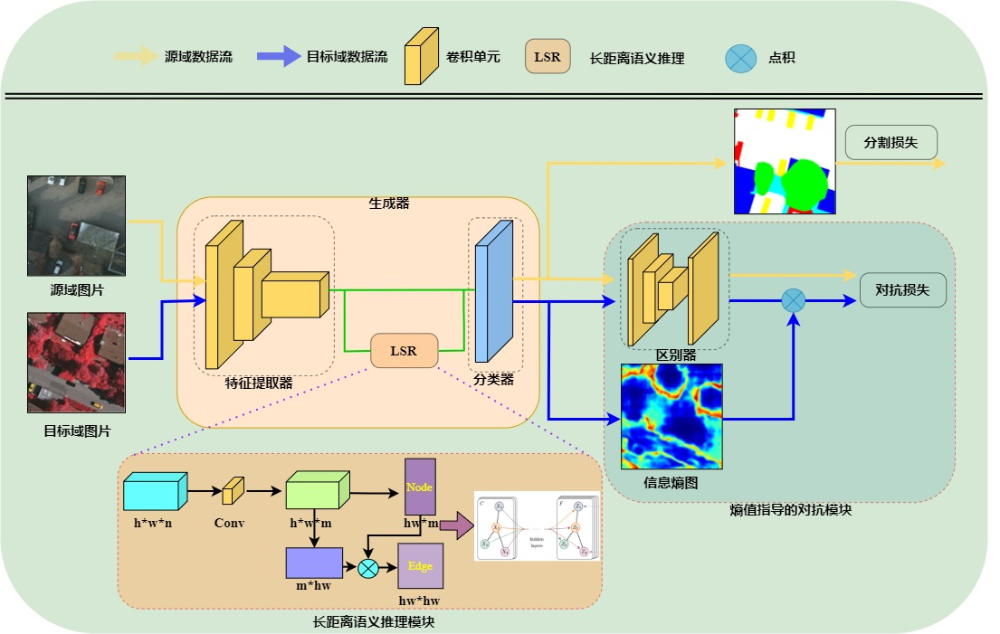

# Entropy Guided Adversarial Domain Adaptation for Aerial Image Semantic Segmentation[J]. IEEE Transactions on Geoscience and Remote Sensing, 2022, 60: 1-14.

本代码整理框架基于CLAN改进，
# Taking A Closer Look at Domain Shift: Category-level Adversaries for Semantics Consistent Domain Adaptation (CVPR2019)
This is a [pytorch](http://pytorch.org/) implementation of [CLAN](http://openaccess.thecvf.com/content_CVPR_2019/papers/Luo_Taking_a_Closer_Look_at_Domain_Shift_Category-Level_Adversaries_for_CVPR_2019_paper.pdf).

为了避免在全局特征对齐中造成负迁移问题，提出了基于熵值指导的无监督领域自适应网络（EGA: the Entropy Guided Adversarial Domain Adaptation network）
主体框架包含两个模块：生成器（G: Generator）和区别器（D: Discriminator），
生成器旨在生成特征表示图和预测图，其中包含一个基于残差网络（ResNet-101）的DeepLab网络和一个嵌入的长距离语义推理（LSR: Long-range Semantic Reasoning）模块。
区别器是一个基于卷积神经网络的二分类器。
提出方法的生成器模块中主要包含三个部分：
1）特征提取器（E: Feature Extractor），采用深度卷积神经网络提取来自源域和目标域数据流中的特征（F: Feature）；
2）嵌入的LSR模块，用来探索图片间的结构信息，并增强局部的特征表示能力；
3）分类器（M: Classifier），产生每条数据流对应的概率预测图。
区别器作用在生成器的输出空间上，并基于目标域数据流来计算信息熵图，然后使用权重图来指导两个域预测空间上的特征对齐，
从而缩小域间差异，提高领域自适应模型对不变域的特征提取能力。

网络结构图：

	

文件结构：
dataset：
    Potsdam_dataset.py ： Potsdam数据加载函数（重要，数据加载函数）
    Vaihngen_dataset.py : Vaihingen 数据加载函数（重要，数据加载函数）

model：
    deeplab.py    简单的deeplab结构  （重要，deeplab代码框架需看懂，DA任务重用的框架就是这，可以结合上面CLAN学习）
    deeplab_vis.py    简单的deeplab结构,输出预测结果和特征图
    GCN_AL_model2.py  网络结构，sum融合特征 (重要，提出的网络框架，GCN聚合后的特征与原来的特征sum拼接)
    GCN_AL_model2.py_concat.py  网络结构，sum融合特征 (重要，提出的网络框架，GCN聚合后的特征与原来的特征concat拼接)
    resnet.py  基本的resnet结构

utils:
    loss.py 交叉熵损失，和权重指导的交叉熵损失
    metricsRM.py  度量指标(重要，常见的度量指标，OA，iou，miou)
    domain_classifier.py  域分类器
    util.py  对于深度特征提取器提取的特征图直接构建图结构

训练模型：
    python train_resnet.py baseline网络（基准网络，常见的基于deeplab的领域自适应网络）
    python train_gcn2.py  baseline+LSR(重要，添加GCN网络来增强尚上下文特征表示能力)
    python train_resnet_entropy.py  baseline+EGA(重要，基准方法上添加EGA，考虑局部特征对齐来缩小全局特征误对齐的影响)
    python train_gcn2_entropy_PM.py  添加两个模块后的训练（重要，添加LSR和EGA，考虑上下文推理以及局部特征对齐）
    python train_gcn2_entropy_PM_plot.py  添加两个模块后的训练（重要，添加LSR和EGA，考虑上下文推理以及局部特征对齐,同时每2000次迭代计算一次准确率）

测试模型：
    python evaluate_plan_resnet.py 对训练阶段保存的模型进行测试,baseline ,baseline + EGA
    python evaluate_plan_gcn2.py 对训练阶段保存的模型进行测试  ,baseline + LSR , baseline + LSR +EGA

绘制测试集预测结果：
    python evaluate_show_gcn2.py
    python evaluate_show_Resnet.py  根据评测指标，选择最优的模型，保存所有分割结果

计算不同域适应模型间缩小域间距离的效果：
    python Proxy_distance.py

可视化分析代码：
    python TSNE_show_resnet.py   对基准方法训练模型的预测结果，选择图片中的像素点，绘制特征TSEN分布图
    python TSNE_show_gcn2.py   对添加图网络的方法训练模型的预测结果，选择图片中的像素点，绘制特征TSEN分布图

本代码主要package及版本
- Python 3.7
- conda==4.8.3
- numpy==1.16.2
- opencv-python==4.1.0.25
- scipy==1.2.1
- tensorboardX==1.8+b5ab572
- torch==1.1.0
- torchvision==0.3.0

